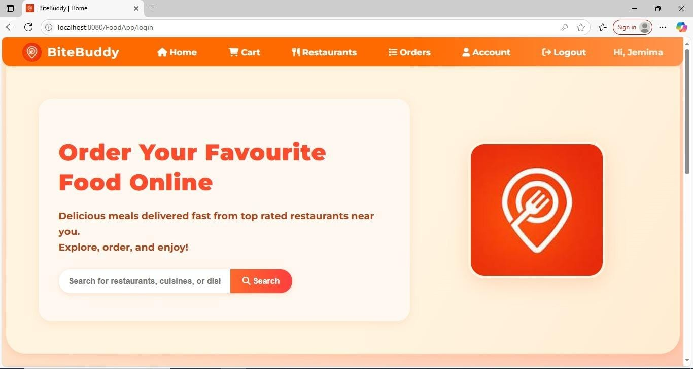
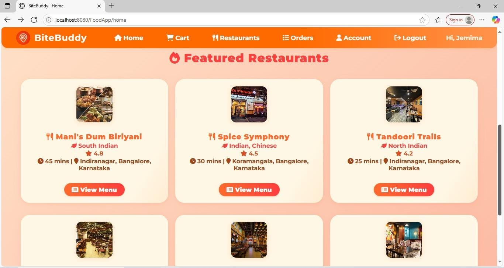
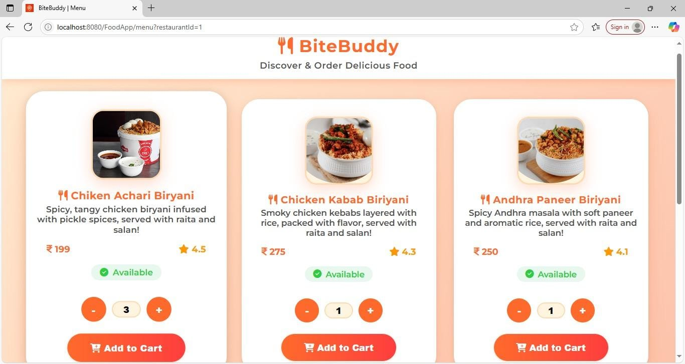
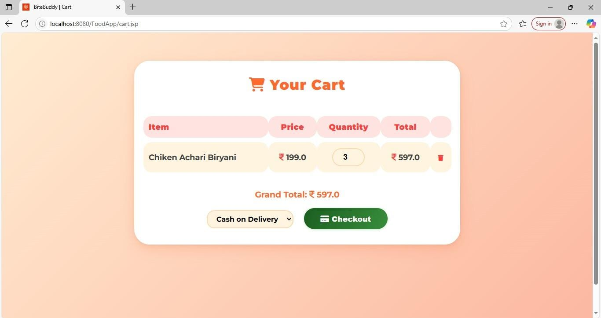
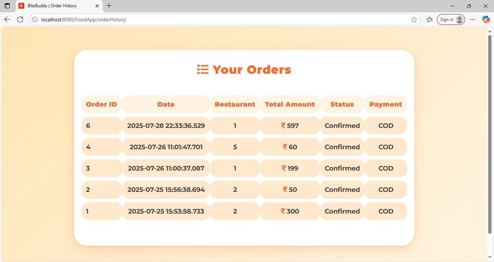

# 🍽️ BiteBuddy - Online Food Delivery App 🚀

Welcome to **BiteBuddy**, your go-to destination for fast, fresh, and flavorful food delivery!  
Craving something tasty? Order from the best restaurants near you and get it delivered right to your doorstep in no time.  

Whether you're a **Customer**, **Restaurant Admin**, **Delivery Agent**, or **SuperAdmin** – BiteBuddy serves everyone with ease and flavor! 😋

## 🌟 Features

### 👤 User Registration & Login  
- Supports multiple roles: **Customer**, **RestaurantAdmin**, **DeliveryAgent**, and **SuperAdmin**

### 🏪 Restaurant Listings  
- Browse and search restaurants with filters by **cuisine**, **location**, or **category**

### 🍽️ Menu Display  
- View dynamic menus with **images**, **ratings**, **prices**, and **availability**

### 🛒 Smart Shopping Cart  
- Add, update, and remove items seamlessly before checkout

### 💳 Checkout & Payments  
- Choose from various payment methods: **Cash on Delivery (COD)**, **Card**, **UPI**

### 📦 Order Placement & History  
- Place new orders and view your **order history**, including item and delivery details

### 🔒 Secure Authentication  
- **Session-based login/logout** for protected access

### 🛠️ Role-Based Access  
- Custom **dashboards and permissions** based on user roles
## 🛠️ Technologies Used

| Layer        | Technology                        |
|--------------|-----------------------------------|
| 💻 Frontend   | HTML, CSS, JSP                    |
| 🖥️ Backend    | Java (Servlets, JSP)              |
| 🗄️ Database   | MySQL                             |
| 🌐 Server     | Apache Tomcat 10                  |
| ☕ ORM/DAO    | Custom Java DAO Implementation    |

## 📸 Screenshots

### 🏠 Home Page  

### 🍽️ Restaurant Listing  

### 🍔 Menu Page  

### 🛒 Cart & Checkout  

### 📦 Order History  

